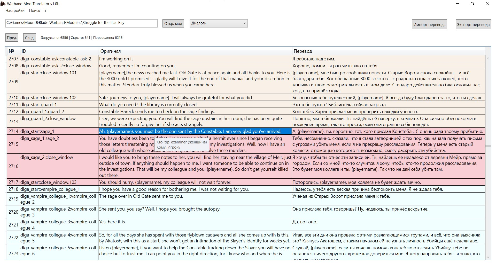

# Warband Mod Translator

Для работы требуется .NET 8

Утилита для перевода модов для Mount and Blade Warband

Из возможностей:

1) Быстрый экспорт\импорт перевода в(из) игру(ы).
2) Подсветка персонажей в зависимости от их пола и того, к кому они обращаются в диалогах (если это возможно определить)
3) Возможность сравнения текущей версии мода и старой, для вывода в таблицу разницы. 

Проверялась на глобальных модах:

Prophesy of Pendor V3.9.5
A World of Ice and Fire
Perisno 1.5.3
Warzone 1.2

и некоторых других.

Утилита делалась на скорую руку, ещё весьма сырая, но рабочая.

